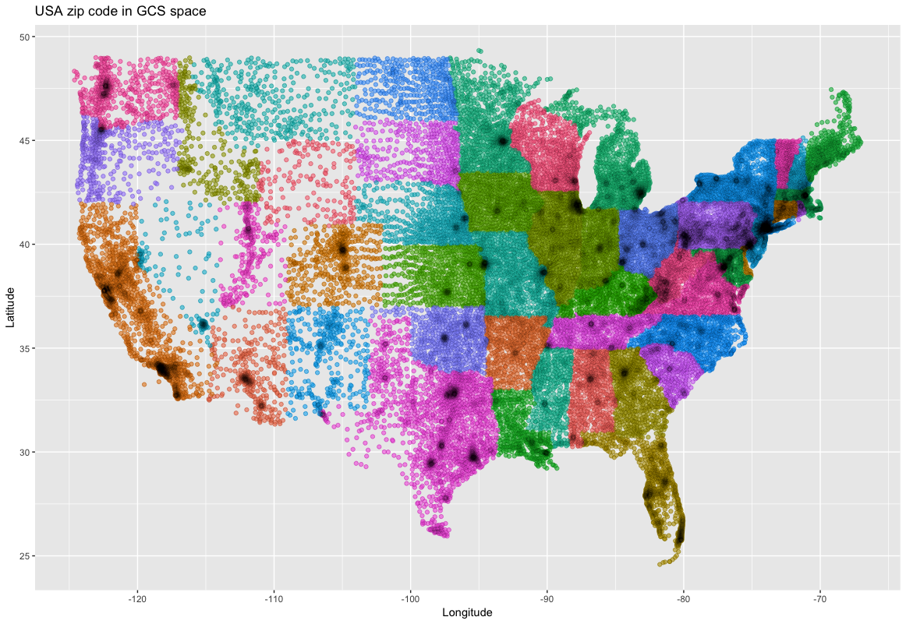

# US zip code plotting
The object of this assignment is to: 
* Find a dataset that contains the longitude and latitude coordinates for all US zip codes.
* Remove all zip codes that are not in the contiguous United States, i.e., Alaska, Hawaii, and Puerto Rico.
* Plot the points as an XY scatter.

This plot was created in R. See [Create_Map.R](/Create_Map.R), above, for details.

