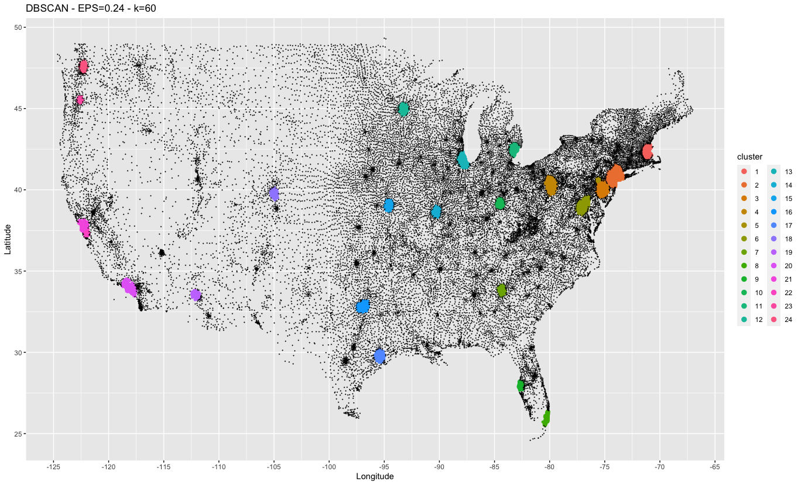

# US zip code clustering
The object of this assignment is to: 
* Find large cities based on the density of zip codes in an area.
* Plot to visualize the results.

To accomplish this I used DBSCAN (Density-based spatial clustering of applications with noise) in R. After importing the data and removing the non-contiguous states (Puerto Rico, Alaska, Hawaii), the first major decision is deciding on an EPS and k value. The EPS value defines the radius around the current point that the algorithm will consider. The k value is used to determine if the current point under consideration is a core point, boarder point, or noise point. One way to get an idea of suitable values is to create a k nearest neighbor distance plot. To do this we calculate the k-dist for all the points, sort them in increasing order, and plot them. By looking at where the plot values start to sharply increase, we can get an idea of what to set the EPS value to. Because we’re only interested in finding high density cities, I’ve set the k value to 60 and dropped the EPS value to 0.24. This is shown on the kNN plot below. Note, I’ve purposely set the EPS value low, after the values start to level off, so that the zip codes that aren’t in major cities are considered noise.

Once we determine what values seem reasonable it's time to run DBSCAN and plot the results. In the plot below, balck points are noise points and the colored points are different clusters.

