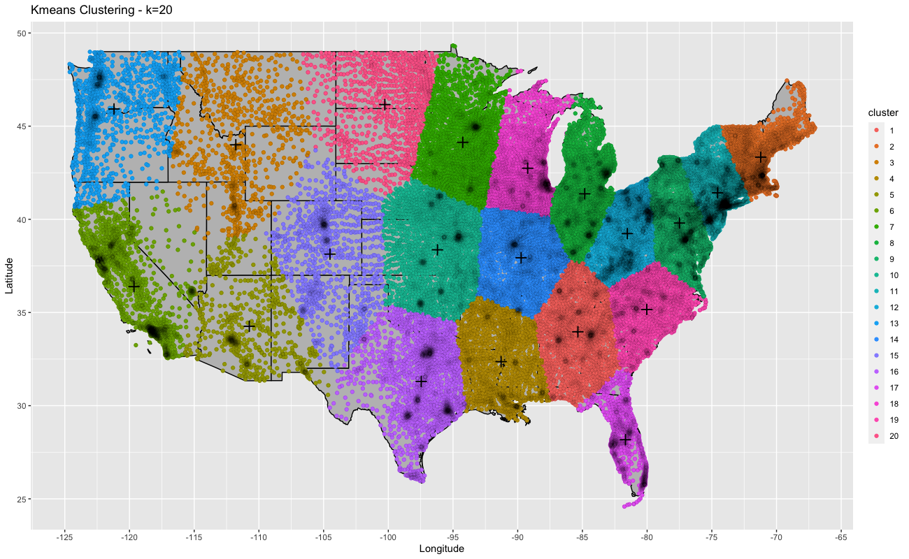

# Top 20 US cities based on clustering
The object of this assignment is to: 
* Find the top 20 cities based on the density of zip codes in an area.
* Plot to visualize and validate the results.

To accomplish this, I used DBSCAN (Density-based spatial clustering of applications with noise) in R. After importing the data and removing the non-contiguous states (Puerto Rico, Alaska, Hawaii), the first major decision is deciding on an EPS and k value. The EPS value defines the radius around the current point that the algorithm will consider. The k value is used to determine if the current point under consideration is a core point, boarder point, or noise point. One way to get an idea of suitable values is to create a k nearest neighbor distance plot. To do this we calculate the k-dist for all the points, sort them in increasing order, and plot them. By looking at where the plot values start to sharply increase, we can get an idea of what to set the EPS value to. Because we’re only interested in finding high density cities, I’ve set the k value to 70 and dropped the EPS value to 0.25. This is shown on the kNN plot below. Note, I’ve purposely set the EPS value low, after the values start to level off, so that the zip codes that aren’t in major cities are considered noise. Reaching these exact values required some experimentation of EPS and k - so that the clustering algorithm would return 20 clusters.

The results of running DBSCAN with EPS = 0.25 and k = 70 are listed in the table below. This table represents the number of zip codes that were assigned to each of the 20 clusters. Note, cluster group 0 consists of the zip codes that are considered noise when the arguments above are used with the algorithm. 

| Cluster | Zip Code Count |
|---      |---             |
| 0       | 28446          |
| 1       | 225            |
| 2       | 806            |
| 3       | 333            |
| 4       | 299            |
| 5       | 342            |
| 6       | 94             |
| 7       | 128            |
| 8       | 92             |
| 9       | 163            |
| 10      | 125            |
| 11      | 267            |
| 12      | 100            |
| 13      | 122            |
| 14      | 154            |
| 15      | 157            |
| 16      | 105            |
| 17      | 73             |
| 18      | 379            |
| 19      | 151            |
| 20      | 75             |

To get a better idea of how the zip codes we're clustered, we can plot them using their latitude / longitude coordinates and color them according to the cluster that they were assigned. In the plot below, you can see that the clusters do tend to be located at major US cities.

This can be made clearer by removing the noise points from the dataset and plotting the clustered zip codes on a map of the USA. Note, in this plot each point has been given a black border and the opacity of each point has been turned down so that we can visualize the stacking effect of many points in one area. Therefore, the dark areas at the center of the clusters can be interpreted as a very dense region of each cluster. This makes it much clearer that the clusters are in fact congregating at major US cities.

At this point, it would be interesting to see how well our top 20 clusters match up with the top 20 populated cities in the US. To examine this, I created a new data frame that contained the GPS coordinates for the top cites. This ranking is a 2019 estimate based on the 2010 census ([link to data](https://en.wikipedia.org/wiki/List_of_United_States_cities_by_population)). We can plot these cities on the US map to visualize their location.

To visualize whether the DBSCAN clustering aligns with the top 20 populated US cities we can combine the previous two graphs. In other words, we can overlay the populated cites on top of the DBSCAN cluster visualization. Note, the black border from the zip code points have been removed for clarity. The top 20 populated cities are represented as black circles and the DBSCAN clusters are colored according to their cluster assignment.

You can see from the graph above that the clustering is somewhat aligned with the top 20 populated US cites. Specifically, 11 out of 20, or 55% of the total clusters match. There are also a couple of cases where it looks like the clustering merged two of the top populated cities into one cluster. For example, San Francisco / San Jose and Fort Worth / Dallas. This is most likely due to the fact that the set of cites are in close proximity to one another and the sprawling nature of the zip codes around them. This makes it difficult to distinguish the cities as separate. The other major difference between the two sets is the 9 clusters that don’t match. This can be partially explained the density of zip codes in an area that isn’t directly related to the population of a city. For example, a large city might have many similarly sized cities around it. This would result in a higher density of zip codes over a larger area. On the other hand, a very large city could be spread out over a large area. This distribution difference of zip codes could explain why a fraction of our clusters don’t line up with the top populated cites.

# k-means: an alternative clustering algorithm
One advantage of using the density-based clustering algorithm DBSCAN is that we can adjust the input arguments to weed out the less dense areas and focus on the high-density clusters. With methods like k-means, it’s not possible to do this. However, it is still interesting to see how the algorithm classifies the zip codes into the same 20 bins. After running k-means, with a cluster size of 20, the results are plotted on top of a map of the US. The color of each point indicates which cluster it belongs to. The center, that was used to cluster the zip codes, is indicated by a + symbol. Since all points are considered and must be assigned to one of the 20 groups, it results in larger areas of the map belonging to each of the 20 clusters. In other words, we’ve lost the ability to resolve individual cities.

